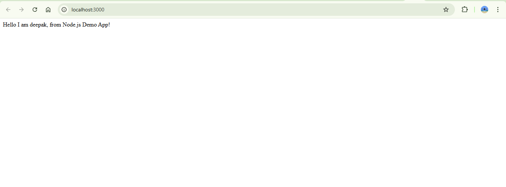

## Automating Code Deployment Using CI/CD Pipeline.

### This project sets up an automated CI/CD pipeline for deploying a Node.js application using GitHub Actions and DockerHub.

- Configured GitHub Actions to automate build, test, and deployment.

- Created a Dockerfile to containerize the application.

- Used DockerHub to store and share container images and credentials.

- Set up a CI/CD pipeline that runs on push to the main branch.

- Ensured Docker image deployment to DockerHub.

Successfully ran locally through installing npm (npm install) and then starting npm (npm start).

